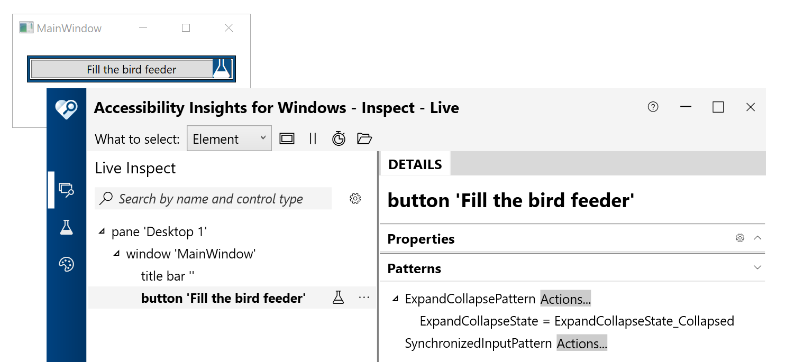
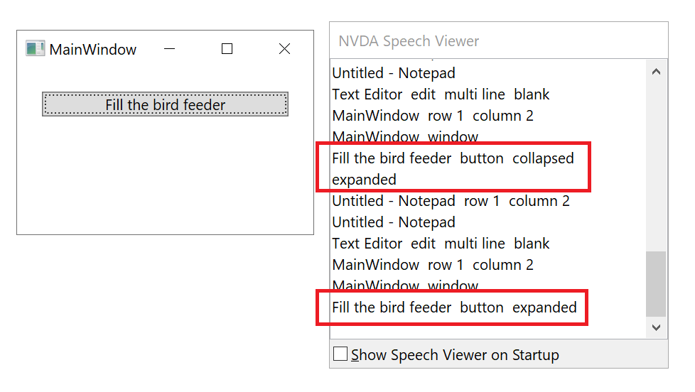

# WPF_Core5_ExpandableButton

WPF provides a variety of controls which can help you get a great head start with accessibility. It's great fun perusing what's available at [Controls by Category](https://docs.microsoft.com/en-us/dotnet/desktop/wpf/controls/controls-by-category).

In some situations you may feel you're using a control which is the best semantic match for the functionality, but it'd be helpful to your customer if you add support for a UI Automation pattern that's not natively supported by the control. And so maybe some use of a custom [AutomationPeer](https://docs.microsoft.com/en-us/dotnet/api/system.windows.automation.peers.automationpeer?view=net-5.0) might help.

This small demo WPF .NET Core 5 app shows how to add support for the UIA ExpandCollapse pattern to a WPF Button. The app doesn't change the visuals as a shipping app would, but your app probably already does that. With this customization, a screen reader can announce the expanded or collapsed state of the Button, and also make an announcement when the expanded state changes.

The first screenshot below shows the Accessibility Insights for Windows (AIWin) tool reporting that the Button in the app supports the UIA ExpandCollapse pattern. The second screenshot below shows the NVDA screen reader announcement as it interacts with the Button. NVDA announces the Button's expanded state when it encounters the Button, and also the new state when the expanded state changes. 

